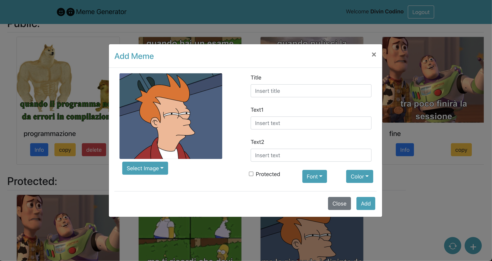

# Exam #2: "Meme Generator"

## Student: s281945 BAUDANZA FILIPPO

## React Client Application Routes

- Route `/`: Home page where is possible to see the memes public or if logged all the memes
- Route `/login`: page with the login form used to client authentication

## API Server

- POST `/api/login`
  - request parameters and request body content
  - response body content
- GET `/api/something`
  - request parameters
  - response body content
- POST `/api/something`
  - request parameters and request body content
  - response body content
- ...

* `GET /api/bases`
* Description: Gets all the properties of the base images in the db
* Request: GET http://localhost:3001/api/bases HTTP/1.1
* Request body: None
* Response: `200 OK` (Success), `500 Internal Server Error`(generic error) or `401 Unauthorized`
* Response body: An array of objects, each describing a base image

```json
[
  {
    "id": 1,
    "path": "/Images/futurama.jpg",
    "name": "Futurama",
    "ntext": 2,
    "position": "top-bottom-m",

  },
  {...}
]
```

---

- `GET /api/memes`
- Description: Gets all the memes in the db
- Request: GET http://localhost:3001/api/memes HTTP/1.1
- Request body: None
- Response: `200 OK` (Success), `500 Internal Server Error`(generic error) or `401 Unauthorized`
- Response body: An array of objects, each describing a task

```json
[
  {
    "id": 1,
    "id_base": 1,
    "title": "giocondo",
    "id_creator": 1,
    "creator":"Pippo",
    "text1":"quando vai in francia",
    "text2":"ma la gioconda è dipinta da un italiano",
    "text3":"",
    "font": "Times New Roman",
    "color":"white",
    "protected": 1
  },
  {...}
]
```

---

- `GET /api/memes/public`
- Description: Gets all the memes not protected in the db
- Request: GET http://localhost:3001/api/memes/public HTTP/1.1
- Request body: None
- Response: `200 OK` (Success), `500 Internal Server Error`(generic error) or `401 Unauthorized`
- Response body: An array of objects, each describing a task

```json
[
  {
     "id": 23,
    "id_base": 2,
    "title": "pallone",
    "id_creator": 1,
    "creator":"Pippo",
    "text1":"quando portavi il pallone al campo di calcetto",
    "text2":"",
    "text3":"",
    "font": "Times New Roman",
    "color":"blue",
    "protected": 0
  },
  {...}
]
```

---

- `POST /api/memes`
- Description: Add a new task to the list of tasks
- Request: POST http://localhost:3001/api/memes HTTP/1.1
- Request body: An object representing a task (Content-Type: application/json).

```json
{
  "id_base": 2,
  "title": "bitcoin",
  "text1": "comprane tanti",
  "text2": "",
  "text3": "",
  "font": "arial",
  "color": "red",
  "protect": 0
}
```

- Response: `201 Created` (success) or `503 Service Unavailable` (generic error) or `401 Unauthorized`. If the request body is not valid, `422 Unprocessable Entity` (validation error).
- Response body:

```json
{
  "addedId": 50
}
```

---

- `DELETE /api/memes/<id>`
- Description: : Delete an existing meme, identified by its id `id`
- Request: DELETE http://localhost:3001/api/memes/2 HTTP/1.1
- Request body: None
- Response: `204 No Content` (success), `503 Service Unavailable` (generic error), `422 Unprocessable Entity` (validation error).
- Response body: None

---

- `POST /api/sessions`
- Description: Lets a user log in the application
- Request: POST http://localhost:3001/api/sessions HTTP/1.1
- Request body: An object with the authetication fields

```json
{
  "username": "pippo.rossi@polito.it",
  "password": "qwerty123"
}
```

- Response: `401 Unauthorized` (failed login) or `200 OK` (success). If the request body is not valid. If the request body is not valid, `422 Unprocessable Entity` (validation error). Otherwise `500 Internal Server Error`(generic error).
- Response body: An object bearing all the information of the user

```json
{
  "id": 1,
  "email": "pippo.rossi@polito.it",
  "name": "Pippo"
}
```

---

- `GET /api/sessions/current`
- Description: Verifies wether the user is authenticaded or not
- Request: GET http://localhost:3001/api/sessions/current HTTP/1.1
- Request body: None
- Response: `200 OK` (Success), `401 Unauthorized` (Not logged in). Otherwise `500 Internal Server Error`(generic error).
- Response body: An object bearing all the information of the user

```json
{
  "id": 1,
  "email": "pippo.rossi@polito.it",
  "name": "Pippo"
}
```

---

- `DELETE /api/sessions/current`
- Description: : Performs the logout
- Request: DELETE http://localhost:3001/api/sessions/current HTTP/1.1
- Request body: None
- Response: `200 OK` (success), `503 Service Unavailable` (generic error)
- Response body: None

---

## Database Tables

- Table `users` - contains id email name hash
- Table `images` - contains id path name ntext position
- Table `memes` - contains id id_base title id_creator creator text1 text2 text3 font color protecte (id_base references to id of images table; id_creator references to id of users table)

## Main React Components

- `MyList` (in `MyList.js`): component used to list alla the memes. inside the component has two list of MyListItem one of public memes and one of protected memes.
- `MyListItem` (in `MyListItem.js`): component used to wrap memes and relative modal. inside the component has a component Meme and the modal of info and copy (modal of copy is the same component of the add modal).
- `Meme`(in `Meme.js`): component used to show a preview of the meme and to provide the buttons (info/copy/delete)
- `Cardimg`(in `Meme.js`): component used to display the image and the texts which compose the meme
- `AddButton` (in `AddButton.js`): component used to provide the creation of a new meme
- `RefreshButton`(in `RefreshButton.js`):component used to provide refresh of the meme list
- `AddModal`(in `AddModal.js`): component used to display with a modal the form to create or copy a new meme
- `InfoModal`(in `InfoModal.js`): component used to display the informations of a meme.

(only _main_ components, minor ones may be skipped)

## Screenshot



## Users Credentials

**Email** : pippo.rossi@polito.it, **Password** : qwerty123 **id Created Memes** : 1 23 24 45 48

**Email** : giuseppe.verdi@polito.it, **Password** : qwerty123 **id Created Memes** : 31 32 33 46

**Email** : roberto.baggio@polito.it, **Password** : qwerty123 **id Created Memes** : 35 36 42 47
